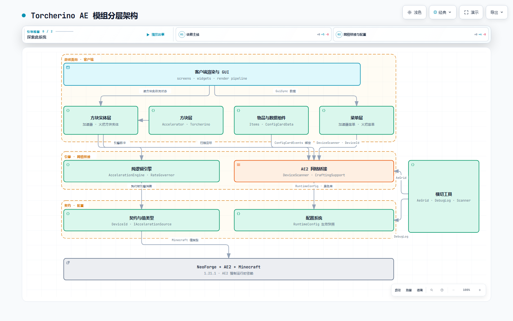

# Torcherino AE（AE 加速器 · AE 加速火把）

> 一个面向 **Minecraft 1.21.1 / NeoForge** 的 **Applied Energistics 2（AE2）加速附属模组**。
> 灵感源自 Torcherino 的「时间加速」，并将其深度嵌入 AE2 的网格体系：加速不再是独立机制，
> 而是由 ME 网络供电、可在 GUI 中勾选管理、可与合成 CPU 联动的「网格服务」。

| 项目 | 说明 |
| --- | --- |
| 模组 ID | `torcherino_ae_mod` |
| 版本 | `1.01` |
| 运行环境 | Minecraft 1.21.1 · NeoForge ≥ 21.1.248 · Java 21 |
| 硬性依赖 | AE2 ≥ 19.2（含运行时依赖 GuideME ≥ 21.1.1） |
| 作者 | Tian_Hai、五世桃花亭 |
| 仓库 | https://github.com/TianHaiY07/torcherinoaemod-template-1.21.1 |

---

## 简介

本模组新增「AE 加速器」与「AE 加速火把」两类方块及配套物品，用两种思路对 AE2 机器加速：

- **AE 加速器**：一台真正的 AE2 机器。接入 ME 网络并用 AE 能量驱动，在 GUI 中勾选网络内的
  设备进行加速，每台设备可独立调节倍率；还能选择合成 CPU 开启「智能加速」，在合成期间自动
  联动加速参与合成的机器。
- **AE 加速火把**：无需接线的范围加速源。以火把为中心扫出一个长方体区域，对区域内（可以来自
  不同 AE 网络）的可加速设备统一施加一个倍率。

两种方式都**不会**加速网络基础设施（存储总线、P2P 隧道、能量元件等本身无 tick 工作可言的
设备），加速对象是真正有逻辑在跑的 AE2 机器。

---

## 内容一览

| 内容 | 名称 | 说明 |
| --- | --- | --- |
| 方块 | **AE 加速器** | AE2 机器：接入网格 + AE 能量供电 + 4 格升级卡槽 + 设备加速 GUI |
| 方块 | **AE 加速火把** | 独立范围扫描加速源，GUI 调节倍率与 X/Y/Z 三个方向的范围 |
| 物品 | **AE 加速器升级卡 I / II / III** | 各档首张倍率 ×2 / ×4 / ×8，可重复插入、同档边际收益递减 |
| 物品 | **加速器配置卡** | 把一台加速器与网络内设备绑定，插入卡槽后按绑定关系自动注入/撤销加速 |

---

## 玩法指南

### 1. AE 加速器：让 ME 网格内的机器跑得更快

1. 将加速器像普通 AE2 机器一样接入 ME 网络，并保证网络有 AE 能量（能量元件等供电）；
2. 打开加速器 GUI，网格内所有可加速设备会以列表形式呈现，同时列出网络的合成 CPU；
3. **左键**点击设备条目切换加速 / 取消加速，**右键**打开弹窗为该设备单独设置加速倍数
   （范围 `1x ~ 当前最高倍率`，设为 `1x` 即取消该设备加速）；
4. 设备列表支持搜索过滤，并有工作状态提示：`工作中 / 已接入网络，等待能量 / 未接入网络`。

> 加速器在界面（方块外观）上有 ONLINE / WORKING 状态：接电时呈激活发光的「工作带」，运转时
> 叠加流光粒子效果，一眼即可看出当前是否在干活。

### 2. 加速倍数与升级卡

- 加速器存在一个「最高加速倍数」，默认基础为 **×4**，由**加速器升级卡**逐张放大；
- 三种升级卡可重复插入 4 格升级槽（同种可多张）：I/II/III 各档**第一张**按 ×2 / ×4 / ×8 全价生效，
  同一档重复堆叠时**边际收益递减**（每多插一张，增益按配置 `accelerator.cardDiminishing` 的比例
  向 1 收敛，默认 0.45）：

```
单卡/混插: 最高倍率 = 基础倍率(默认 4) × I系数^[I>0] × II系数^[II>0] × III系数^[III>0]
同档堆叠:  第 n+1 张同档卡的实际倍率 = 1 + (第 n 张实际倍率 - 1) × cardDiminishing
```

例如 1 张 III 卡（×8）时最高为 `4 × 8 = 32x`；4 张 III 卡满配约为 `526x`（而非旧的指数式 16384x），
曲线后期平缓但仍值得堆卡。若希望完全还原旧的指数累乘，把 `accelerator.cardDiminishing` 设为 `1.0` 即可。
默认不设硬上限，服主还可通过服务端配置 `accelerator.maxMultiplierCap` 设置最高倍数天花板
（`-1` 表示不限制）。

### 3. 智能加速：合成 CPU 联动

在加速器 GUI 的「合成 CPU」区域选中一个 CPU 后开启智能加速：**在该 CPU 执行合成期间**，
加速器会自动加速参与合成的设备（分子装配室、压印机、充能器等），合成结束即停止，无需手工逐个勾选。
默认作用域 `ALL_ACCELERATABLE` 会把网络内**全部可加速设备**（含第三方 AE 工作机器）都纳入联动，
零配置兼容任意 AE 附属；如需精确到「仅合成执行机器」，可把 `crafting.smartAccelerateScope`
改为 `CRAFTING_MACHINES`。服务端默认启用，可通过 `crafting.smartAccelerateEnabled` 关闭。

### 4. 加速器配置卡：一次绑定、随处生效

1. 手持配置卡 **Shift + 右键**一台 AE 加速器，将其绑定到卡上；
2. 之后**右键**网络内的设备即可逐个加入 / 移出绑定列表（单卡上限 64 台，改绑加速器会清空旧设备列表）；
3. 把卡片放入加速器的卡槽：卡上记录的所有设备会**自动按各自的绑定状态注入加速**；
   取出卡片则**精确撤销**这些加速，不干扰玩家在 GUI 里手工勾选的设备；
4. 绑定信息随物品保留，坐标含维度标识，跨维度同坐标的方块不会被误认成同一台。

### 5. AE 加速火把：不接线的范围加速

- 自身**不需要**接入 ME 网络，也不消耗 AE 能量；
- 服务端会以火把为中心，扫描一个长方体区域内的可加速设备（过滤标准与加速器一致），
  火把可同时加速区域内属于**不同 AE 网络**的机器；
- GUI 中可独立调节 **加速倍数** 与 **X / Z / Y 三个方向的范围**。默认值为倍率 ×4、
  X/Z 半径 ±3、Y 半径 ±2，实际可调上限由服务端配置下发（见下），默认上限倍率 ×4、X/Z ±8、Y ±4。

---

## 能耗模型

加速器每 tick 从 ME 网络抽取的 AE 能量为：

```
能耗(AE/t) = 1.0 + 0.5 × 升级卡总数 + 0.5 × 被加速设备数
```

能耗与倍率**解耦**（加速 2x 与 256x 的能耗相同），只随「升级卡数量」与「被加速设备数量」线性
增长。当网络能量缓冲低于 90%（`power.bufferFraction`）时加速器会停止加速以保住缓冲，避免反复停机。
火把不耗能。以上数值均可由服务端配置调整。

---

## 合成配方

**AE 加速火把**

```
|  | 时钟 |  |
| 时钟 | 石英固定器 | 时钟 |     即 4 个时钟呈十字围住中央的石英固定器
|  | 时钟 |  |
```

> 材料：4× 时钟、1× 石英固定器（AE2）。

**AE 加速器**

```
| 加速卡 | 分子装配室 | 加速卡 |
| 分子装配室 | AE加速火把 | 分子装配室 |
| 加速卡 | 分子装配室 | 加速卡 |
```

> 材料：4× 加速卡（AE2）、4× 分子装配室（AE2）、1× AE 加速火把。

**AE 加速器升级卡 I / II / III**

| 配方 | 产物 |
| --- | --- |
| 9× 加速卡（AE2）围成 3×3 | AE 加速器升级卡 I |
| 9× 升级卡 I 围成 3×3 | AE 加速器升级卡 II |
| 9× 升级卡 II 围成 3×3 | AE 加速器升级卡 III |

**加速器配置卡**（无序合成）

> 材料：1× 基础卡（AE2） + 1× 福鲁伊克斯水晶（AE2）。

---

## 服务器配置

运行后在 `config/` 目录生成两份配置文件，修改后**服务端热重载**即生效：

- `torcherino_ae_mod-server.toml` —— 服务端全部数值与行为开关；
- `torcherino_ae_mod-client.toml` —— 客户端界面 / 渲染开关。

主要配置分组（默认值即本 README 描述的行为基线）：

| 分组 | 关键项 | 默认值 |
| --- | --- | --- |
| `accelerator` | 基础倍率 / 三档卡系数 / 最高倍数上限 | `4` / `[2, 4, 8]` / `-1`（不限） |
| `power` | 基础能耗 / 每卡增量 / 每设备增量 / 停机缓冲占比 | `1.0` / `0.5` / `0.5` / `0.9` |
| `torcherino` | 火把最大倍率 / X·Z 最大半径 / Y 最大半径 | `4` / `8` / `4` |
| `budget` | 每台源每 tick 的加速调用预算 | `-1`（不限） |
| `cache` / `menu` | 目标缓存重建周期 / GUI 设备列表刷新周期 | `20` / `20`（tick） |
| `grid` | 不可加速黑名单 / 合成机器兜底类型（全限定类名） | 默认内置三类基础设施 / 压印机、充能器 |
| `crafting` | 智能加速总开关 / 联动作用域 | `true` / `ALL_ACCELERATABLE` |
| `debug` | 诊断日志开关 / 采样间隔 | `false` / `20` |
| `client` | 列表过滤缓存 / 配置卡高亮渲染开关 | `true` / `true` |

---

## 安装

1. 安装 **NeoForge 21.1.248+** 与 **AE2 19.2+**（Modrinth / CurseForge，需同时装有其强制运行时
   依赖 **GuideME**）；
2. 将本模组的 `.jar` 放入 `mods/` 文件夹后启动游戏即可。

## 从源码构建

```bash
# Windows（PowerShell）
$env:JAVA_HOME = "C:\你的\Java21\JDK路径"
.\gradlew build

# macOS / Linux
JAVA_HOME=/path/to/jdk21 ./gradlew build
```

构建产物位于 `build/libs/`。开发运行可用 `gradlew runClient`；单元测试 `gradlew test`。

---

## 架构图（Architecture）

本模组采用严格的**单向分层**设计（`api → core → config → network → 方块实体/菜单/物品/方块 → client`），
并让「AE 加速器」（接 ME 网络、耗 AE 能量，经 `AccelerationEngine` 脉冲加速）与「AE 加速火把」
（独立范围扫描、不耗 AE 能量，三条加速路径并行）两条路径复用同一套可加速设备判定与倍率调控。
完整架构见下图（点击可进入**可交互**版本，支持缩放、检索、聚焦、深浅色切换）：

[](docs/torcherino-ae-architecture.html)

> 也可直接打开交互式架构图：[`docs/torcherino-ae-architecture.html`](docs/torcherino-ae-architecture.html)

---

## 已知边界 / FAQ

- **不加速网络基础设施**：存储总线、P2P 隧道、能量元件等没有 tick 工作可言的设备被有意排除
  （服务端 `grid.acceleratableBlacklist` 可调整），要加速请把目标对准真正在跑的机器。
- **智能加速默认覆盖全部可加速设备**：`crafting.smartAccelerateScope` 默认 `ALL_ACCELERATABLE`，
  网络内所有非黑名单设备在选中 CPU 合成期间都会被联动，因此第三方 AE 工作机器**无需任何配置**即可兼容。
  若只想加速「真正执行合成的机器」（`ICraftingMachine` / `CRAFTING_MACHINE` 能力判定，内置压印机、
  充能器兜底），将其改为 `CRAFTING_MACHINES`，并在 `grid.craftingMachineExtraTypes` 追加类型。
- **倍率太高 CPU 吃紧？** 服务端 `budget.tickCallsPerSource` 可限制每台加速器每 tick 对网格节点的
  调用次数；若仍不够，请合理控制升级卡堆叠与同时加速的设备数。
- **存档 / 版本**：加速目标登记、配置卡绑定均以含维度的设备身份持久化，跨维度不会误判；
  本模组曾重构状态存储格式，旧档数据需要重新登记一次（单机测试档建议备份）。

---

## 许可

- 本模组元数据中 `license` 声明为 **All Rights Reserved**（保留所有权利）。
- 项目骨架来源于 NeoForged MDK 模板，其模板部分许可见根目录 `TEMPLATE_LICENSE.txt`（MIT）。
- AE2 / GuideME 均为其各自作者的财产，仅作依赖引用。

感谢 NeoForge 与 Applied Energistics 2 社区提供的优秀工具与生态。
